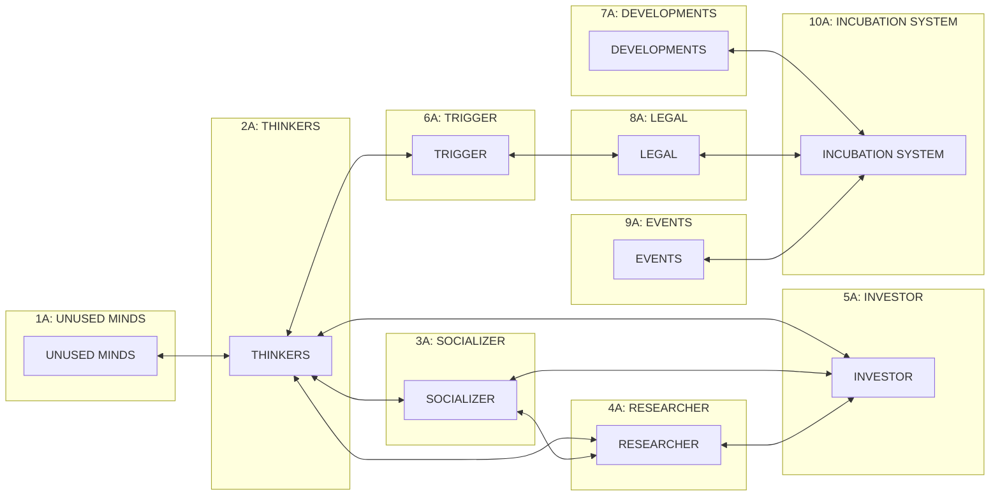

# PRODUCT FLOW

```mermaid
graph LR
subgraph 1A: UNUSED MINDS
    1A["UNUSED MINDS"]
end

subgraph 2A: THINKERS

    2A["THINKERS"]
end

subgraph 3A: SOCIALIZER


    3A["SOCIALIZER"]
end

subgraph 4A: RESEARCHER


    4A["RESEARCHER"]
end

subgraph 5A: INVESTOR


    5A["INVESTOR"]
end

subgraph 6A: TRIGGER


    6A["TRIGGER"]
end

subgraph 7A: DEVELOPMENTS


    7A["DEVELOPMENTS"]
end

subgraph 8A: LEGAL


    8A["LEGAL"]
end

subgraph 9A: EVENTS


    9A["EVENTS"]
end

subgraph 10A: INCUBATION SYSTEM
10A["INCUBATION SYSTEM"]
end

%% 1A <--> 2A
%% 2A <--> 3A
%% 2A <--> 4A
%% 2A <--> 5A
%% 2A <--> 6A
%% 7A <--> 10A
%% 8A <--> 10A
%% 9A <--> 10A
%% 3A <--> 4A
%% 3A <--> 5A
%% 4A <--> 5A
%% 6A <---> 8A


1A <--> 2A
2A <--> 3A
2A <--> 4A
2A <--> 5A
2A <--> 6A
6A <--> 8A
7A <--> 10A
8A <--> 10A
9A <--> 10A
3A <--> 4A
3A <--> 5A
4A <--> 5A


```
